# 🛒 E-Commerce Management System

A full-stack **E-Commerce Management System** developed using **Spring Boot**, **React.js**, and **PostgreSQL**.

The application provides separate dashboards and features for **Customers**, **Sellers**, and **Administrators**. It includes secure JWT authentication, product management, shopping cart functionality, address management, order processing, and online payment integration.

---

# 🚀 Features

## 👤 Customer Features

- User Registration
- User Login
- JWT Authentication
- Browse Products
- Search Products
- View Product Details
- Browse Products by Category
- Add Products to Cart
- Update Cart Quantity
- Remove Products from Cart
- View Cart Summary
- Manage Shipping Addresses
- Select Shipping Address
- Place Orders
- View Order History
- View Order Details
- Update User Profile

---

## 🛍 Seller Features

- Secure Seller Login
- Seller Dashboard
- Add New Products
- Edit Product Details
- Delete Products
- Manage Product Inventory
- Upload Product Images
- View Customer Orders
- Manage Orders
- Track Order Status

---

## 👨‍💼 Admin Features

- Secure Admin Login
- Admin Dashboard
- Manage Users
- Manage Sellers
- Manage Categories
- Manage Products
- Manage Orders
- Platform Monitoring

---

# 🔐 Authentication & Security

- JWT Authentication
- Spring Security
- Role-Based Access Control (RBAC)
- Protected REST APIs
- Password Encryption using BCrypt
- Authentication and Authorization
- Secure Cookie-Based JWT Authentication

---

# 📦 Product Management

- Category Management
- Product CRUD Operations
- Product Image Upload
- Product Search
- Product Pagination
- Product Sorting
- Product Inventory Management

---

# 🛒 Shopping Cart

- Add Products to Cart
- Update Product Quantity
- Remove Products from Cart
- View Cart Summary
- Calculate Total Price
- Checkout

---

# 📍 Address Management

- Add Address
- Update Address
- Delete Address
- Select Shipping Address
- Manage Multiple Addresses

---

# 📑 Order Management

- Place Orders
- View Orders
- View Order Details
- View Order History
- Seller Order Management
- Update Order Status

---

# 💳 Payment

- Stripe Payment Integration
- PayPal Payment Integration
- Secure Checkout Process

---

# 🛠 Tech Stack

## Backend

- Java 17
- Spring Boot
- Spring MVC
- Spring Security
- Spring Data JPA
- Hibernate
- JWT Authentication
- PostgreSQL
- Maven
- Lombok

## Frontend

- React.js
- React Router
- Redux
- Redux Toolkit
- Axios
- Tailwind CSS
- Material UI
- React Icons

## Tools

- Git
- GitHub
- Postman
- Spring Tool Suite (STS)
- Visual Studio Code

---

# 📂 Project Structure

```text
E-Commerce-Management-System/
│
├── backend/
│   ├── src/
│   │   └── main/
│   │       ├── java/
│   │       └── resources/
│   │
│   ├── pom.xml
│   └── application.properties
│
├── frontend/
│   ├── src/
│   ├── public/
│   ├── package.json
│   └── package-lock.json
│
├── images/
│   ├── address.png
│   ├── adminpanel.png
│   ├── cart.png
│   ├── checkout.png
│   ├── home.png
│   ├── login.png
│   ├── ordersummary.png
│   ├── payment.png
│   ├── paymentmethod.png
│   ├── products.png
│   ├── register.png
│   └── sellerpanel.png
│
├── README.md
└── .gitignore
---

# 📸 Application Screenshots

## 🏠 Home Page

<p align="center">
  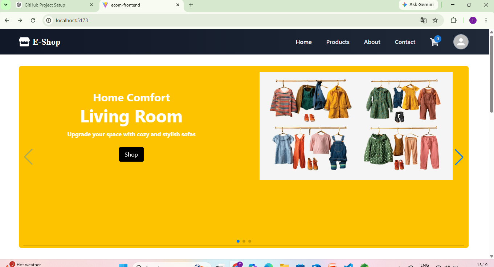
</p>

---

## 🔐 Login Page

<p align="center">
  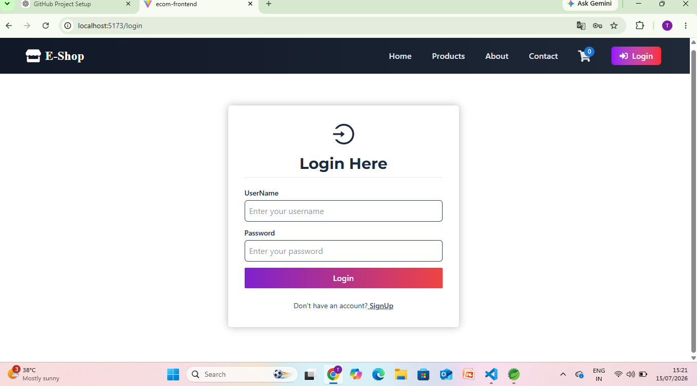
</p>

---

## 📝 Register Page

<p align="center">
  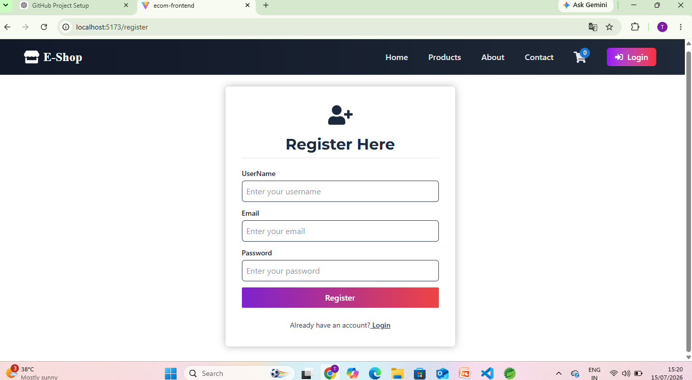
</p>

---

## 📦 Products Page

<p align="center">
  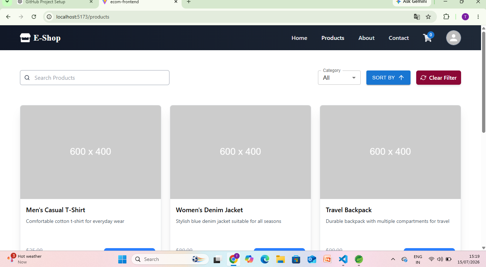
</p>

---

## 🛒 Shopping Cart

<p align="center">
  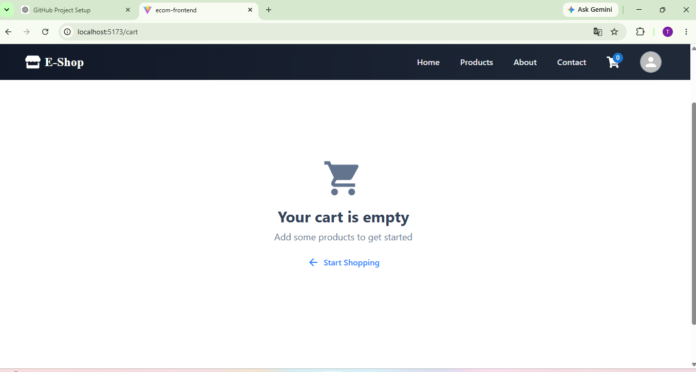
</p>

---

## 📍 Address Management

<p align="center">
  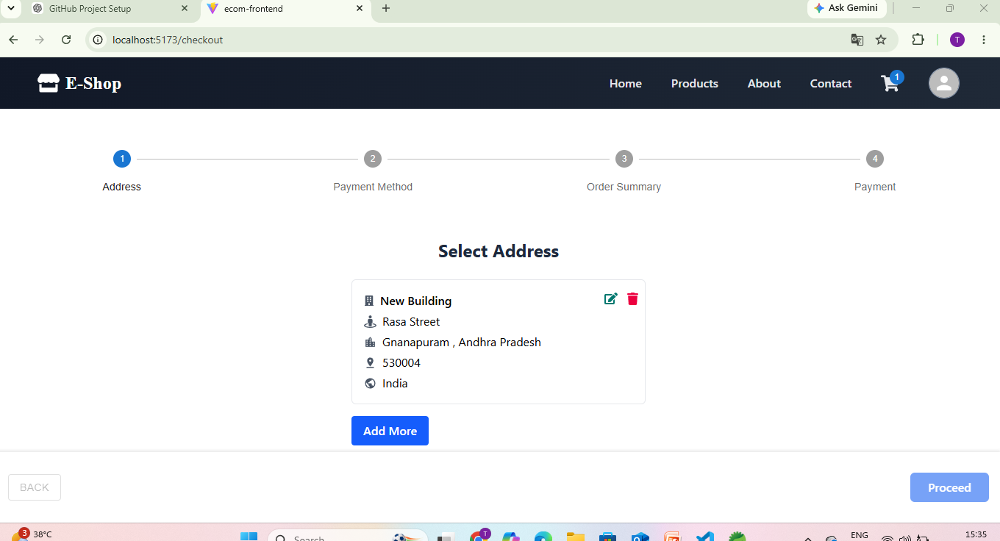
</p>

---

## 💳 Checkout Page

<p align="center">
  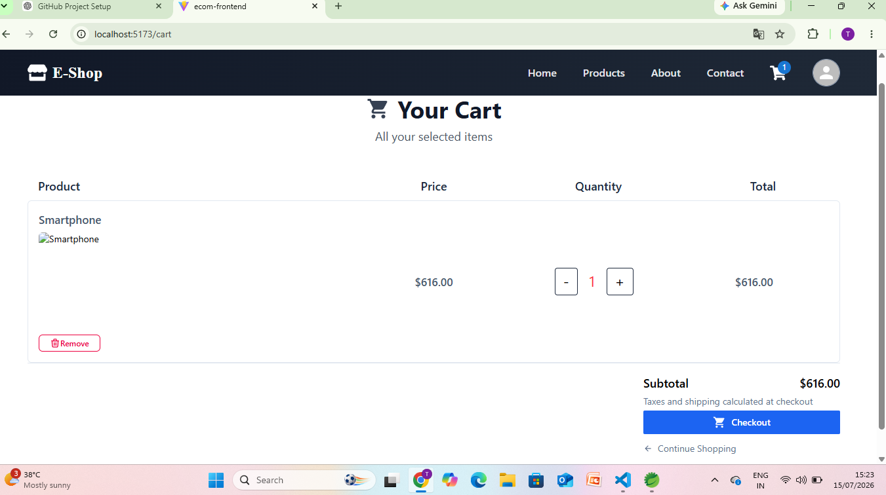
</p>

---

## 💰 Payment Method

<p align="center">
  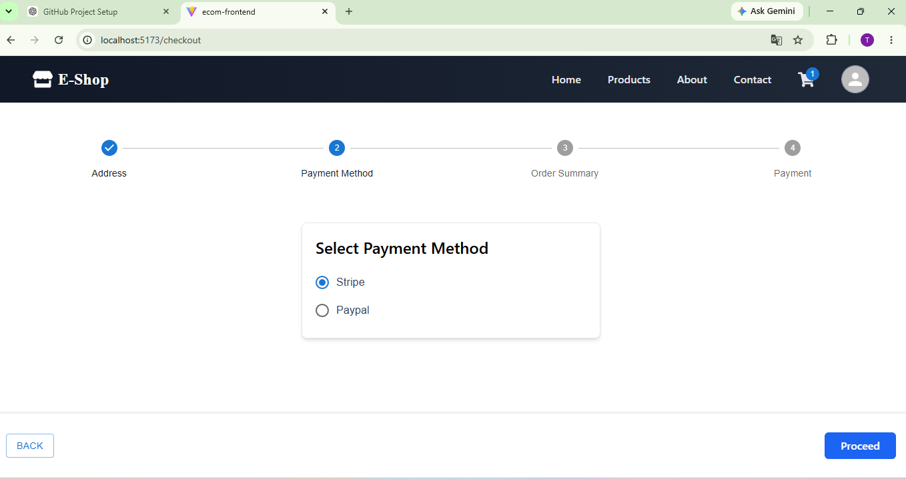
</p>

---

## 📦 Order Summary

<p align="center">
  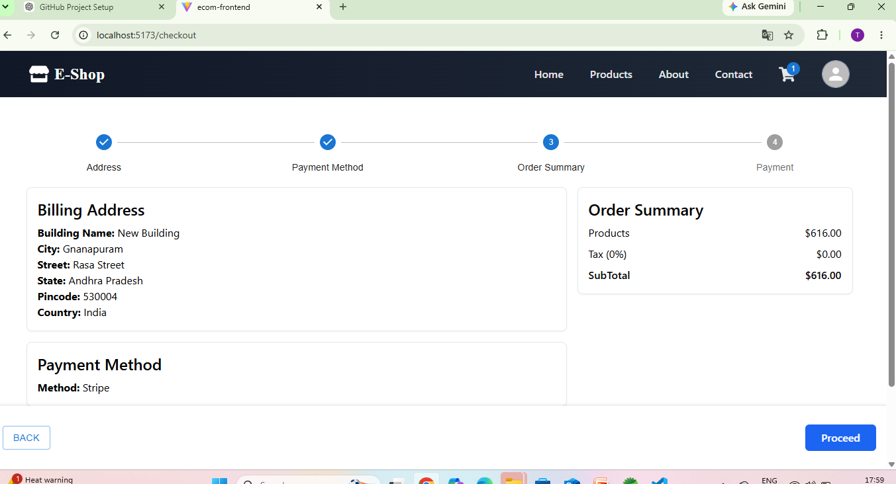
</p>

---

## 💳 Payment Page

<p align="center">
  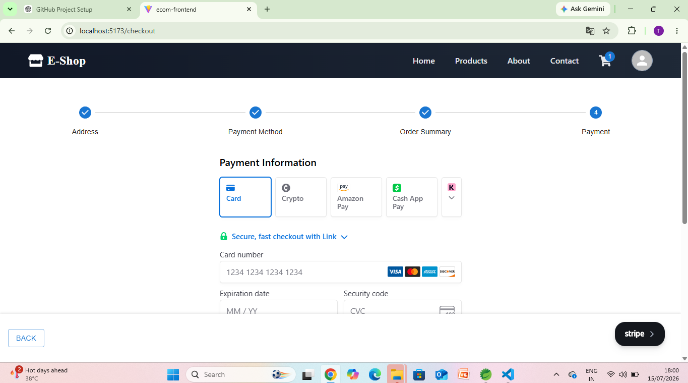
</p>

---

## 👨‍💼 Admin Panel

<p align="center">
  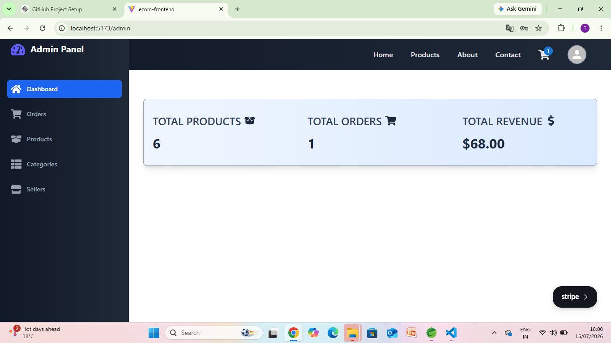
</p>

---

## 🛍 Seller Panel

<p align="center">
  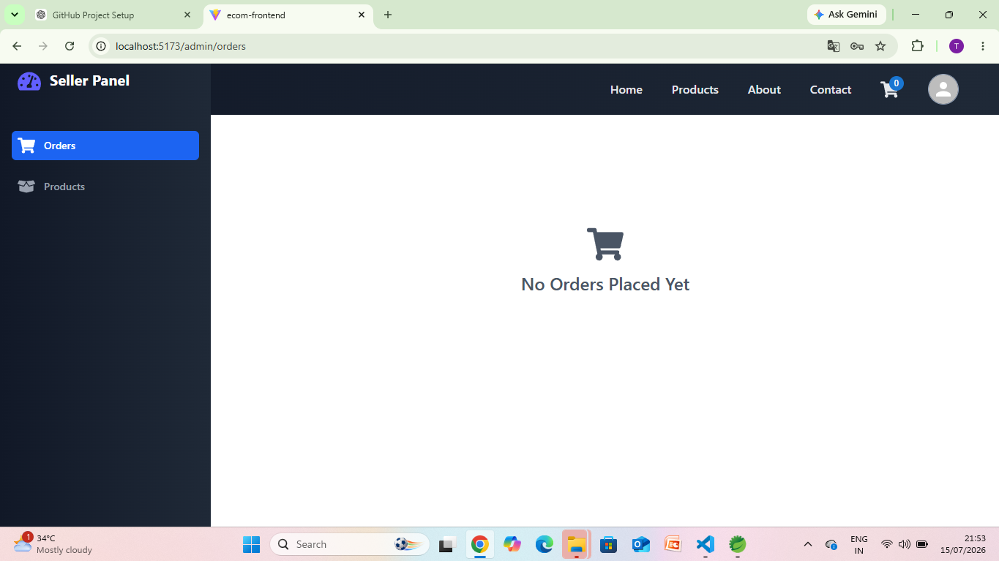
</p>

---

# 🔧 Installation

## 1. Clone the Repository

```bash
git clone https://github.com/tejaswini-java-dev/ecommerce.git

# ⚙️ Backend Setup

Navigate to the backend project:

cd backend

Build the project:

mvn clean install

Run the Spring Boot application:

mvn spring-boot:run

The backend will run on:

http://localhost:8080

---

# ⚛️ Frontend Setup

Navigate to the frontend project:

cd frontend

Install the required dependencies:

npm install

Start the React application:

npm run dev

The frontend will run on:

http://localhost:5173

---

# 🔧 Environment Configuration

## Backend

Configure the following values in your application.properties file or environment variables:

DATASOURCE_URL=your_database_url
DATASOURCE_USER=your_database_username
DATASOURCE_PASSWORD=your_database_password
FRONTEND_URL=http://localhost:5173
STRIPE_SECRET_KEY=your_stripe_secret_key

---

## Frontend

Create a .env file if your frontend uses environment variables:

VITE_API_URL=http://localhost:8080/api

---

# 🗄️ Database

This project uses:

PostgreSQL

Create a PostgreSQL database and configure the database connection details in the backend configuration.

Example:

spring.datasource.url=jdbc:postgresql://localhost:5432/ecommerce
spring.datasource.username=postgres
spring.datasource.password=your_password

---
# 🔑 User Roles

The application supports the following roles:

ROLE_USER
ROLE_SELLER
ROLE_ADMIN

Each role has different permissions and access levels.

---

# 📚 Concepts Implemented

- Spring Boot REST APIs
- Spring MVC
- Spring Security
- JWT Authentication
- Role-Based Access Control (RBAC)
- Spring Data JPA
- Hibernate ORM
- Entity Relationships
- PostgreSQL
- Pagination
- Sorting
- Bean Validation
- Lombok
- React Hooks
- React Router
- Redux
- Redux Toolkit
- Axios
- Tailwind CSS
- Material UI
- Shopping Cart
- Address Management
- Order Management
- Stripe Payment Integration
- PayPal Payment Integration

---

# 🚀 Future Improvements

- Product Reviews and Ratings
- Wishlist
- Coupon and Discount System
- Inventory Analytics
- Sales Reports
- Email Notifications
- Advanced Order Tracking
- Product Recommendations
- Admin Analytics Dashboard

---

# 📄 License

This project is developed for learning and portfolio purposes.